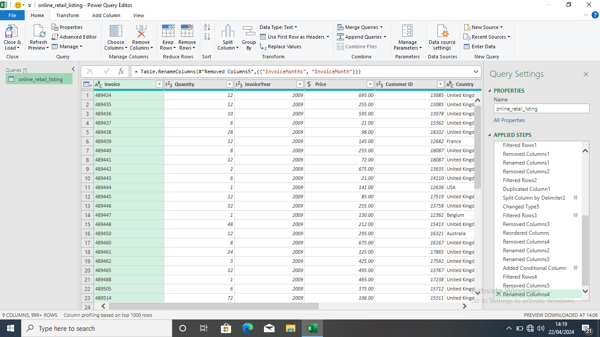
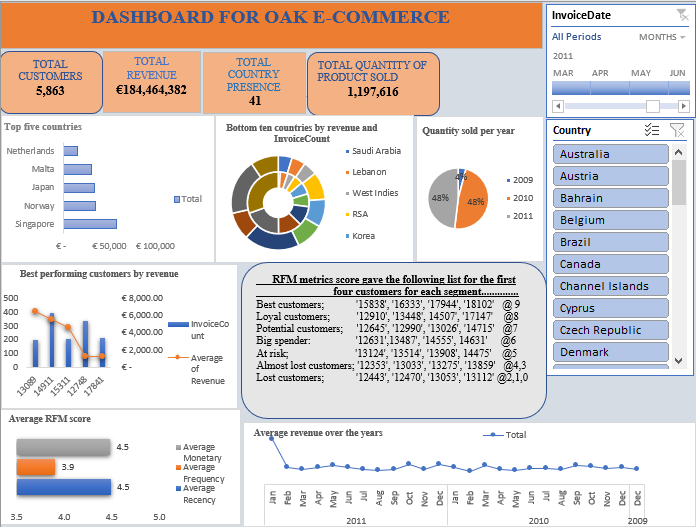
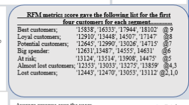

# RFM-Analysis
## INTRODUCTION
 

This is a RFM (Recency, Frequency, Monetary) analysis of a fictional e-commerce store operating in forty-one countries. It is a CSV file with 1,046,000 rows and 9 columns. The aim is to optimize revenue operations using Excel. 

## PROBLEM STATEMENT
To thoroughly clean the data and visually analyse the following KPIs;

➡️ Top five countries contributing the most to revenue

➡️ Bottom countries by revenue and invoicecount

➡️ Best performing customers by revenue

➡️ Average revenue over the years

➡️ Average RFM score

➡️ Segmentation score

➡️ Total quantity sold per year

## SKILLS DEMONSTRATED
Power Query, Data Cleaning, RFM analysis, Pivot table/pivot chart Slicers/Timeline, Data Visualization

## DATA CLEANING/TRANSFORMATION 
For Data Cleaning, the following were done:
1. Possible duplicates were removed from the CustomerID table
2. Remove null values in customerID
3. Converting date column from character format to a date time format
4. Drop stockcode and description column
5. Cancelled order includes "C" in the invoiceID and are removed
6. Removing null values in the month column
7. Month and year were extracted from the InvoiceDate table 
8. Adding a revenue column by calculating the price and quantity column
9. Converting the revenue column to currency format. 

 

You can interact with the spreadsheet [here](https://docs.google.com/spreadsheets/d/15lvIXC9geIL_HR_06xYoU-A1rMiR_k26/edit?usp=drivesdk&ouid=103896574810186091201&rtpof=true&sd=true)

## VISUALIZATION
Singapore is the country with the highest revenue  

The company has its presence in 41 countries

Total revenue accumulated is €184,464,382

January 2011 has the highest average revenue while February 2010 has the lowest average revenue

 

## RFM Analysis
Using an excel function, the customers were ranked according to:
  Recency: Amount of elapsed time since last purchase. 
   Frequency: Count of purchase
   Monetary: Total revenue from their total transaction.

 

## CONCLUSION
Although we have the best performing customers from revenue, it is impossible to determine customer retention using only revenue which is the importance of RFM. With this, we are able to build a better picture of all our customers and the possibility of being a repeat buyer. 
